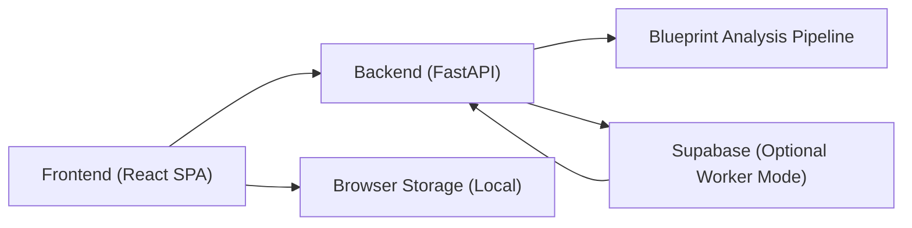
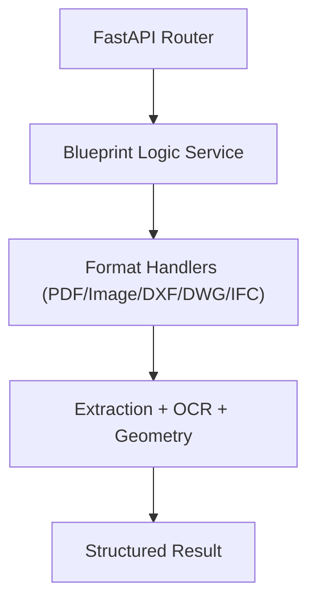
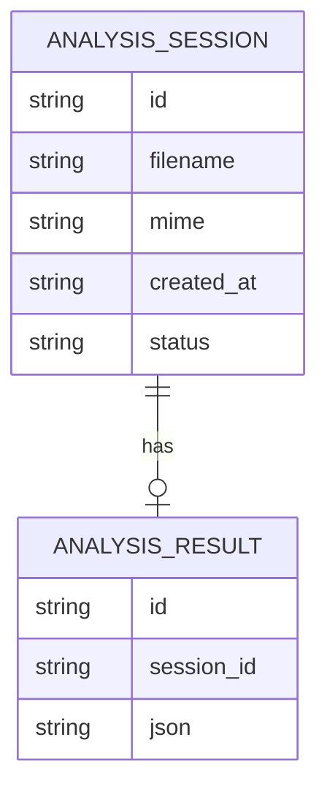

## 1. Architecture Design



Frontend is a standalone web app in this repository (new `/frontend` folder) that:
- Submits blueprint files to the FastAPI endpoint for analysis
- Renders results in a structured, exportable format
- Uses code-based animations (SVG/CSS) to create a “video-like” innovative hero without external assets

## 2. Technology Description
- Frontend: React@18 + TypeScript + tailwindcss@3 + vite
- Routing: react-router-dom
- Data fetching: fetch API (no extra client needed)
- Backend: existing FastAPI service in `backend/main.py`
- Deployment: static frontend build (served via any host) + backend deployed separately (Railway/Docker as currently configured)

## 3. Route Definitions
| Route | Purpose |
|-------|---------|
| / | Home (marketing + CTA) |
| /upload | Upload blueprint and submit analysis |
| /results | Display latest analysis results (and/or results by job id) |
| /about | Product and pipeline explanation |
| /contact | Contact form |

## 4. API Definitions

### 4.1 Base URL
- Frontend reads backend base URL from environment variable `VITE_API_BASE_URL`
- Default dev assumption: `http://localhost:8000`

### 4.2 Analyze Blueprint
- Method: `POST`
- Path: `/analyze-blueprint`
- Content-Type: `multipart/form-data`
- Request form fields:
  - `file`: the uploaded blueprint file

TypeScript shapes used in the UI (final keys depend on backend response):

```ts
export type AnalyzeBlueprintResponse = {
  rooms?: Array<{
    name?: string
    area?: number
    unit?: string
    confidence?: number
    notes?: string
  }>
  totals?: {
    total_area?: number
    unit?: string
    room_count?: number
  }
  boq?: Array<{
    item?: string
    quantity?: number
    unit?: string
    rate?: number
    amount?: number
  }>
  raw?: unknown
}
```

UI behavior:
- If backend returns a different shape, UI stores raw response under `raw` and still renders a readable JSON view + export.

## 5. Server Architecture Diagram



## 6. Data Model

### 6.1 Client-side State Model
Client keeps the latest analysis result and upload metadata in memory, with optional persistence:



### 6.2 Data Definition Language (Frontend Only)
No database required. Optional local persistence uses `localStorage` with a single key:
- `blueprintReader:lastResult` (stringified JSON)
