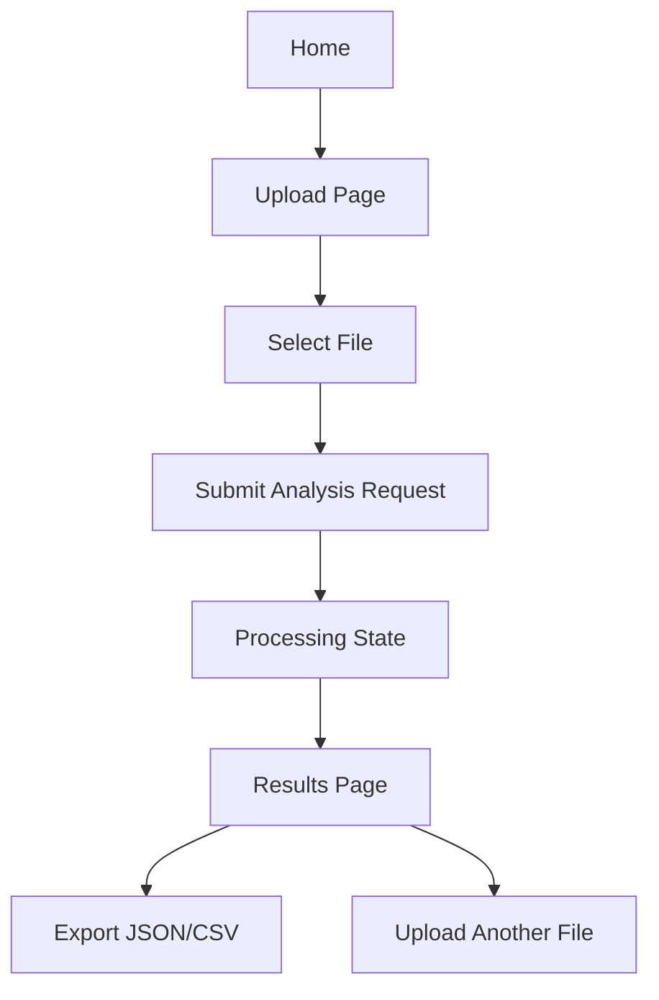

## 1. Product Overview
Blueprint Reader UI is a professional, innovation-forward web interface for uploading blueprints and receiving structured room/area takeoffs and a BOQ-style summary.
- Target users: architects, contractors, estimators, and builders who need fast, reliable blueprint insights
- Value: turns drawings into actionable quantities with a modern workflow and clear, premium presentation

## 2. Core Features

### 2.1 Feature Module
1. **Home**: product narrative, animated “blueprint intelligence” hero, capabilities, example outputs, CTA to upload
2. **Upload**: file upload (PDF/JPG/PNG/DXF/DWG/IFC), job submission, progress states, error handling
3. **Results**: structured output view (rooms, areas, totals), export section (JSON/CSV download), visual summary
4. **About**: product story and pipeline explanation (blueprint → extraction → analysis → outputs)
5. **Contact**: inquiry form (client-side validation), copy-to-clipboard email, simple success state

### 2.2 Page Details
| Page Name | Module Name | Feature description |
|-----------|-------------|---------------------|
| Home | Top navigation | Fixed nav with minimal links: Home, Upload, About, Contact |
| Home | Animated hero | Editorial typography + “blueprint scanning” animation and micro-interactions, CTA buttons |
| Home | Capabilities | Cards describing supported formats, room detection, BOQ outputs |
| Home | Example output | Static sample blocks that look like real results (rooms list, totals, BOQ excerpt) |
| Upload | Upload panel | Drag & drop, accepted format hints, client-side file size/type checks |
| Upload | Submission | Calls backend analysis endpoint and transitions to Results |
| Results | Summary | Total built-up area, room count, high-level metrics |
| Results | Rooms table | Sortable list: room name, area, confidence/notes if available |
| Results | Exports | Download JSON and CSV; copy JSON to clipboard |
| About | Process story | Step-by-step explanation with animated blueprint linework accent |
| Contact | Contact form | Name, email, message, optional company; client-only submit behavior |

## 3. Core Process
User flow focuses on clarity and speed:
1) User lands on Home → understands value → clicks Upload
2) User uploads a blueprint → submits analysis
3) App shows progress states → renders Results → user exports

## 4. User Interface Design

### 4.1 Design Style
- Aesthetic direction: editorial, premium, “architectural studio” feel; innovative but sober
- Color system: warm-white base + graphite text + blueprint-cyan accents + subtle ink-blue surfaces
- Typography: distinctive display serif/sans pairing (display for headlines, refined body font for text)
- Layout: strong grid, generous whitespace, oversized headings, minimal chrome
- Motion: one signature hero animation (blueprint scanning line + animated linework) plus tasteful micro-interactions (hover, focus, scroll reveals)

### 4.2 Page Design Overview
| Page Name | Module Name | UI Elements |
|-----------|-------------|-------------|
| Home | Animated hero | Split layout: headline + body copy left, animated blueprint visual right; CTA buttons; subtle grain/noise overlay |
| Upload | Upload panel | Large drag-drop surface; format chips; progress bar; clear error states |
| Results | Data presentation | Tabs or sections: Summary, Rooms, BOQ; tables with sticky headers; export buttons |
| About | Pipeline story | Timeline-like blocks; animated SVG blueprint accents |
| Contact | Contact form | Minimal fields; accessible focus rings; success confirmation state |

### 4.3 Responsiveness
- Desktop-first composition with a 12-column grid
- Mobile: collapses hero into stacked layout; tables become cards or horizontal scroll with affordances
- Accessibility: keyboard navigation, visible focus, high contrast text, reduced-motion preference respected
